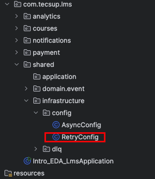
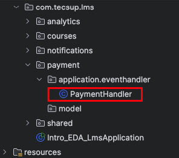
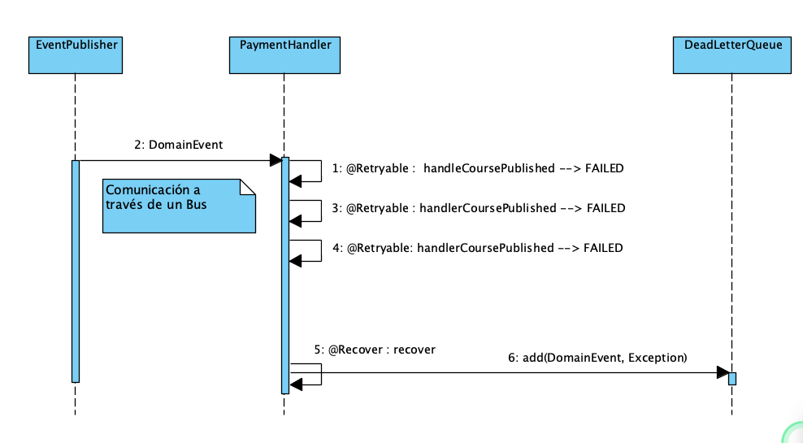
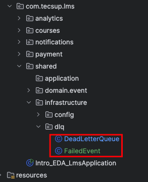

## I - Uso de EDA en Plataforma de Cursos Online


### 1.- Create a New Course

POST : http://localhost:8080/api/courses

```
{
"title": "Spring Boot Masterclass",
"description": "Learn Spring Boot from scratch",
"instructor": "John Doe"
}
```
### 2.- Publish a Course

PUT : http://localhost:8080/api/courses/1/publish?price=10

## II - Ejercicios

### Crear Eventos y Handlers para los siguientes casos:

#### StudentEnrolledEvent
- Handler: Enviar email de bienvenida  
- Handler: Actualizar estadísticas del curso
- Handler: Crear acceso al material

#### LessonCompletedEvent
- Handler: Actualizar progreso
- Handler: Enviar notificación de logro
- Handler: Verificar si completó el curso

## III - Retry en PaymentHandler
Para agregar la funcionalidad de reintentos en el `PaymentHandler`, sigue estos pasos:

1. Agregar Dependencia en el pom.xml 

   ```xml
        <!-- Spring Retry -->
        <dependency>
            <groupId>org.springframework.retry</groupId>
            <artifactId>spring-retry</artifactId>
            <version>2.0.4</version>  <!-- La versión es importante considerarla -->
        </dependency>
        <dependency>
            <groupId>org.springframework</groupId>
            <artifactId>spring-aspects</artifactId>
        </dependency>
   ```
2. Crear el Config Class para habilitar Spring Retry : RetryConfig.java

    

   ```java
   
   import org.springframework.context.annotation.Configuration;
   import org.springframework.retry.annotation.EnableRetry;

   @Configuration
   @EnableRetry  // Habilita la funcionalidad de reintentos
   public class RetryConfig {
   }
   
   ```
3. Modificar el PaymentHandler para agregar la anotación @Retryable

    


   ```java
    
    @Slf4j
    @Component
    public class PaymentHandler {
    
        private final Random random = new Random();
    
        @Async("eventExecutor") // No generara bloqueos
        @EventListener
        // Agrega la anotación @Retryable para reintentos
        @Retryable(
                maxAttempts = 2,  // cantidad de intentos
                backoff = @Backoff(delay = 1000, /* milisegundos */
                        multiplier = 2 /* tiempo de espera entre intentos */)
        )
        public void handleCoursePublished(CoursePublishedEvent event) throws InterruptedException {
            log.info("[{}] Processing payment ...", Thread.currentThread().getName());
    
            if (random.nextBoolean()) {
                log.info("Payment processing taking longer than expected...");
                throw new RuntimeException("Payment processing failed due to timeout");
            }
    
            log.info("Payment finished for course: {}", event.getTitle());
    
        }
    
        
        @Recover  // Manejo cuando se agotan los reintentos
        public void recover(RuntimeException e, CoursePublishedEvent event) {
            log.error("All retries exhausted for payment processing of course: {}", event.getCourseId());
    
            // Store in Dead Letter Queue or take alternative action
            // TODO: Implement DLQ logic here
        }
    
    }

   ```
4. Probar la funcionalidad de reintentos
   - Publicar un curso varias veces para observar el comportamiento de reintentos en caso de


### Ejercicio : Crear intentos de :
- Notification --> NotificationHandler:  ( 2 intentos)
- StudentEnrolledEvent --> Handler: Enviar email de bienvenida ( 2 intentos)


## IV - Dead Letter Queue (DLQ)


    

Para implementar una Dead Letter Queue (DLQ) simple en memoria, puedes seguir estos pasos:

1. Crear una clase FailedEvent para representar los eventos fallidos : FailedEvent.java

    

   ```java
    import com.banco.shared.domain.event.DomainEvent;
    import lombok.AllArgsConstructor;
    import lombok.Getter;

    @Getter
    @AllArgsConstructor
    public class FailedEvent {
    
        private final DomainEvent event;      // Evento que falló
        private final String reason;          // Mensaje de error asociado
        private final long timestamp;         // Marca de tiempo del fallo
    
    }
   ```

2. Crear una clase DLQ para almacenar los eventos fallidos : DeadLetterQueue.java


   ```java
    @Slf4j
    @Component
    public class DeadLetterQueue {
    
        // Coleccion para almacenar eventos fallidos
        private final ConcurrentLinkedQueue<FailedEvent> failedEvents = new ConcurrentLinkedQueue<>();
    
        // Método para agregar un evento fallido a la DLQ
        public void add(DomainEvent event, Exception exception) {
    
            // Crear un objeto FailedEvent con detalles del evento fallido
            FailedEvent failedEvent = new FailedEvent(
                    event,
                    exception.getMessage(),
                    System.currentTimeMillis()
            );
    
            // Agregar el evento fallido a la cola
            failedEvents.add(failedEvent);
    
        }
    
    }
   ```

3. Agregar lógica para almacenar eventos fallidos en la DLQ dentro del PaymentHandler : PaymentHandler.java

   ```java
    @Slf4j
    @Component
    @RequiredArgsConstructor  // Agregar constructor para inyección de dependencias
    public class PaymentHandler {
    
        ......
        private final DeadLetterQueue dlq;  // Inyectar la DLQ
    
        .....
    
    
        @Recover  // Manejo cuando se agotan los reintentos
        public void recover(RuntimeException e, CoursePublishedEvent event) {
            
            .....
            
            dlq.add(event, e);  // Agregar al final del metodo 
        }
    
    }
   ```
4.- Probar la funcionalidad de la DLQ
   - Publicar un curso varias veces para observar que los eventos fallidos se almacenan en la DLQ después de agotar los reintentos.
