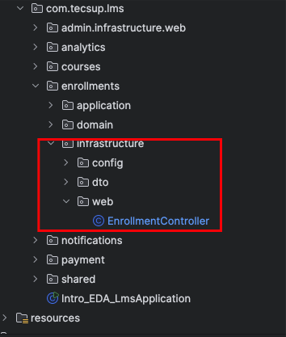

## Implementación de CQRS : Enrollment 

1.- Crear el model de solo lectura, el repositorio y el projection

Localización:


EnrollmentReadModel.java

```.java


import lombok.AllArgsConstructor;
import lombok.Data;

@Data
@AllArgsConstructor
public class EnrollmentReadModel {

    private final String enrollmentId;
    private final String studentId;
    private final String courseId;

    // Data desnornamilzada
    private final String studentName;
    //private final String rolName;

    // Lesson
    private int progressPercentage;

    public EnrollmentReadModel(String enrollmentId) {
        this.enrollmentId = enrollmentId;
        this.studentId = null;
        this.courseId = null;
        this.studentName = null;
        this.progressPercentage = 0;
    }

}

```

EnrollmentQueryRepository.java

```.java


import org.springframework.stereotype.Component;

import java.util.*;

@Component
public class EnrollmentQueryRepository {

    private final Map<String, EnrollmentReadModel>
            readModels = new HashMap<>();

    public void save(EnrollmentReadModel readModel) {
        readModels.put(readModel.getEnrollmentId(), readModel);
    }

    public Optional<EnrollmentReadModel> findById(String id) {
        return Optional.ofNullable(readModels.get(id));
    }

    public List<EnrollmentReadModel> findAll() {
        return new ArrayList<>(readModels.values());
    }

}


```


EnrollmentProjection.java

```.java


import com.tecsup.lms.enrollments.application.query.EnrollmentQueryRepository;
import com.tecsup.lms.enrollments.application.query.EnrollmentReadModel;
import com.tecsup.lms.enrollments.domain.event.LessonCompletedEvent;
import com.tecsup.lms.enrollments.domain.event.StudentEnrolledEvent;
import lombok.RequiredArgsConstructor;
import lombok.extern.slf4j.Slf4j;
import org.springframework.context.event.EventListener;
import org.springframework.stereotype.Component;

@Slf4j
@RequiredArgsConstructor
@Component
public class EnrollmentProjection {

    private final EnrollmentQueryRepository repository;

    @EventListener
    public void onStudentEnrolled(StudentEnrolledEvent event) {

        log.info("📥 Processing StudentEnrolledEvent for student: {}",
                event.getStudentName());

        var readModel = new EnrollmentReadModel(
                event.getEnrollmentId(),
                event.getStudentId(),
                event.getCourseId(),
                event.getStudentName(),
                0
        );
        repository.save(readModel);
    }

    @EventListener
    public void onLessonCompleted(LessonCompletedEvent event) {

        log.info("📥 Processing LessonCompletedEvent for enrollment ID: {}",
                event.getEnrollmentId());

        EnrollmentReadModel readModel = repository.findById(event.getEnrollmentId()).orElseThrow();

        // Actualiza el progreso
        readModel.setProgressPercentage(readModel.getProgressPercentage() +
                event.getNewProgressPercentage());

        // Guarda el read model actualizado
        repository.save(readModel);

    }

}


```

2.- Se realiza las pruebas

EnrollmentProjectionTest.java

```.java    

import com.tecsup.lms.enrollments.application.query.EnrollmentQueryRepository;
import com.tecsup.lms.enrollments.domain.event.LessonCompletedEvent;
import com.tecsup.lms.enrollments.domain.event.StudentEnrolledEvent;
import org.junit.jupiter.api.BeforeEach;
import org.junit.jupiter.api.Test;

import static org.junit.jupiter.api.Assertions.*;

class EnrollmentProjectionTest {

    private EnrollmentProjection projection;
    private EnrollmentQueryRepository repository;

    @BeforeEach
    void init() {
        repository = new EnrollmentQueryRepository();
        projection = new EnrollmentProjection(repository);
    }

    @Test
    void onStudentEnrolled() {

        StudentEnrolledEvent event = new StudentEnrolledEvent(
                "enroll-123",
                "student-456",
                "course-789",
                "John Doe"
        );

        this.projection.onStudentEnrolled(event);

        var readModelOpt = repository.findById("enroll-123");
        assertTrue(readModelOpt.isPresent());
        var readModel = readModelOpt.get();
        assertEquals("enroll-123", readModel.getEnrollmentId());
        assertEquals("student-456", readModel.getStudentId());

    }

    @Test
    void onLessonCompleted() {
        // Primero, inscribir al estudiante
        StudentEnrolledEvent enrollEvent = new StudentEnrolledEvent(
                "enroll-123",
                "student-456",
                "course-789",
                "John Doe"
        );
        this.projection.onStudentEnrolled(enrollEvent);

        // Simular la finalización de una lección
        LessonCompletedEvent lessonEvent = new LessonCompletedEvent(
                "enroll-123",
                "lesson-001",
                20 // Nuevo progreso
        );
        this.projection.onLessonCompleted(lessonEvent);

        // Simular la finalización de una lección
        LessonCompletedEvent lessonEvent2 = new LessonCompletedEvent(
                "enroll-123",
                "lesson-002",
                15 // Nuevo progreso
        );
        this.projection.onLessonCompleted(lessonEvent2);

        var readModelOpt = repository.findById("enroll-123");
        assertTrue(readModelOpt.isPresent());
        var readModel = readModelOpt.get();
        assertEquals(35, readModel.getProgressPercentage());
    }
}
    
```

3.- Modificar EnrollmentController para agregar endpoint de consulta


Localización:




```.java


import com.tecsup.lms.enrollments.application.command.EnrollStudentCommand;
import com.tecsup.lms.enrollments.application.command.EnrollmentCommandHandler;
import com.tecsup.lms.enrollments.application.query.EnrollmentQueryRepository;
import com.tecsup.lms.enrollments.application.query.EnrollmentReadModel;
import com.tecsup.lms.enrollments.domain.model.Enrollment;
import com.tecsup.lms.enrollments.infrastructure.dto.EnrollmentRequest;
import com.tecsup.lms.enrollments.infrastructure.dto.EnrollmentResponse;
import lombok.RequiredArgsConstructor;
import lombok.extern.slf4j.Slf4j;
import org.springframework.http.ResponseEntity;
import org.springframework.web.bind.annotation.*;

@Slf4j
@RestController
@RequestMapping("/api/enrollments")
@RequiredArgsConstructor
public class EnrollmentController {

    private final EnrollmentCommandHandler enrollmentCommandHandler;
    private final EnrollmentQueryRepository enrollmentQueryRepository; // agregar

     ......


    /**
     *  NUEVO END POINT : CQRS --> READ MODE
     * @param id
     * @return
     */
    @GetMapping("/{id}")
    public ResponseEntity<EnrollmentReadModel> getEnrollmentDetails(@PathVariable String id) {
        EnrollmentReadModel readModel = enrollmentQueryRepository.findById(id)
                .orElseThrow(() -> new RuntimeException("Enrollment not found"));

        return ResponseEntity.ok(readModel);
    }


}

   
```

4.- Probar el endpoint de consulta
-  Crear el curso
-  Publicar el curso
-  Inscribir un estudiante
-  El estudiante entrega 2 lecciones
-  Se consulta el endpoint /api/enrollments/{id} para verificar que el read model refleja el progreso actualizado.
    