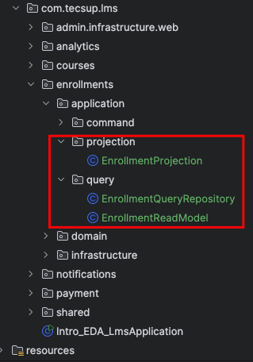

## Implementación de CQRS : Enrollment 

1.- Crear el model de solo lectura, el repositorio y el projection

Localización:




EnrollmentReadModel.java

```.java


import lombok.AllArgsConstructor;
import lombok.Data;

@Data
@AllArgsConstructor
public class EnrollmentReadModel {

    private final String enrollmentId;
    private final String studentId;
    private final String courseId;

    // Data desnornamilzada
    private final String studentName;
    //private final String rolName;

    // Lesson
    private int progressPercentage;

    public EnrollmentReadModel(String enrollmentId) {
        this.enrollmentId = enrollmentId;
        this.studentId = null;
        this.courseId = null;
        this.studentName = null;
        this.progressPercentage = 0;
    }

}

```

EnrollmentQueryRepository.java

```.java


import org.springframework.stereotype.Component;

import java.util.*;

@Component
public class EnrollmentQueryRepository {

    private final Map<String, EnrollmentReadModel>
            readModels = new HashMap<>();

    public void save(EnrollmentReadModel readModel) {
        readModels.put(readModel.getEnrollmentId(), readModel);
    }

    public Optional<EnrollmentReadModel> findById(String id) {
        return Optional.ofNullable(readModels.get(id));
    }

    public List<EnrollmentReadModel> findAll() {
        return new ArrayList<>(readModels.values());
    }

}


```


EnrollmentProjection.java

```.java


import com.tecsup.lms.enrollments.application.query.EnrollmentQueryRepository;
import com.tecsup.lms.enrollments.application.query.EnrollmentReadModel;
import com.tecsup.lms.enrollments.domain.event.StudentEnrolledEvent;
import lombok.RequiredArgsConstructor;
import org.springframework.context.event.EventListener;
import org.springframework.stereotype.Component;

@RequiredArgsConstructor
@Component
public class EnrollmentProjection {

    private final EnrollmentQueryRepository repository;

    @EventListener
    public void onStudentEnrolled(StudentEnrolledEvent event) {
        var readModel = new EnrollmentReadModel(
                event.getEnrollmentId(),
                event.getStudentId(),
                event.getCourseId(),
                event.getStudentName(),
                0
        );
        repository.save(readModel);
    }

}


```