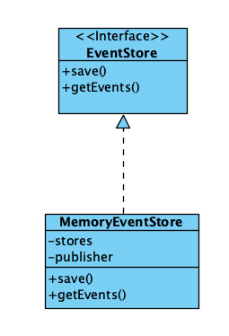
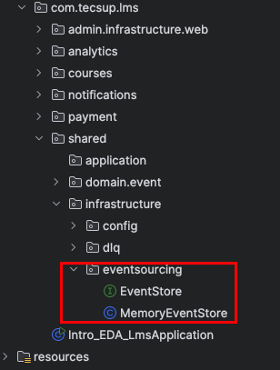
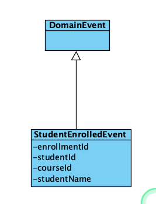
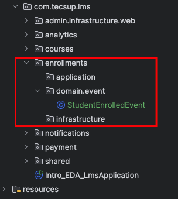
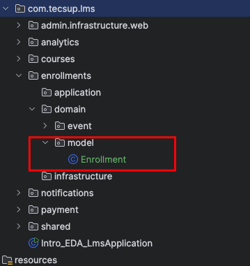
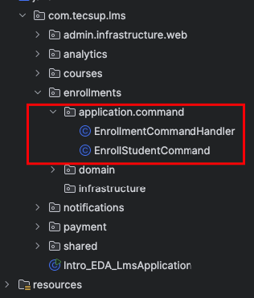
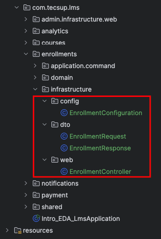

## Implementación de Event Sourcing : Enrollment 

1.- Crear Event Store  
     El Event Store es un almacén de eventos.



Localización: 



EventStore.java
```
import com.tecsup.lms.shared.domain.event.DomainEvent;

import java.util.List;

public interface EventStore {

    void save(String aggregateId, DomainEvent event);

    List<DomainEvent> getEvents(String aggregateId);

}
```

MemoryEventStore.java
```

import com.tecsup.lms.shared.domain.event.DomainEvent;
import lombok.extern.slf4j.Slf4j;
import org.springframework.context.ApplicationEventPublisher;
import org.springframework.stereotype.Component;

import java.util.ArrayList;
import java.util.List;
import java.util.Map;
import java.util.concurrent.ConcurrentHashMap;

@Slf4j
@Component
public class MemoryEventStore  implements EventStore{

    // final es necesario
    private final Map<String, List<DomainEvent>> stores = new ConcurrentHashMap<>();

    private final ApplicationEventPublisher publisher;

    public MemoryEventStore(ApplicationEventPublisher publisher) {
        this.publisher = publisher;
    }

    @Override
    public void save(String aggregateId, DomainEvent event) {

        // Agregar el evento  al stores
        this.stores.computeIfAbsent(aggregateId, key -> new ArrayList<>())
                .add(event);

        // Publicar el evento
        publisher.publishEvent(event);

    }

    @Override
    public List<DomainEvent> getEvents(String aggregateId) {
        return new ArrayList<>(stores.getOrDefault(aggregateId, List.of()));
    }

}

```
MemoryEventStoreTest.java
```

import com.tecsup.lms.shared.domain.event.DomainEvent;
import org.junit.jupiter.api.BeforeEach;
import org.junit.jupiter.api.Test;
import org.springframework.context.ApplicationEventPublisher;

import static org.junit.jupiter.api.Assertions.*;
import static org.mockito.Mockito.mock;


class TestEvent extends DomainEvent {

    private final String data;

    public TestEvent(String data) {
        super();
        this.data = data;
    }
}


public class MemoryEventStoreTest {

    private MemoryEventStore eventStore;
    private ApplicationEventPublisher publisher;

    @BeforeEach
    void ini(){
        publisher = mock(ApplicationEventPublisher.class);
        eventStore = new MemoryEventStore(publisher);
    }

    @Test
    void save() {

        String aggregateId = "matricula-1";
        TestEvent event = new TestEvent("datos de matricula de estudiante 1");
        TestEvent event2 = new TestEvent("datos de matricula de estudiante 2");

        // Guardar el evento
        eventStore.save(aggregateId, event);
        eventStore.save(aggregateId, event2);

        // Recuperar los eventos
        var events = eventStore.getEvents(aggregateId);

        assertEquals(2, events.size());

        //assertEquals(event, events.get(0));

    }
}
```

2.- Crear Eventos de Enrollment
    Evento que se van a producir en el pasado

Se crea en un nuevo modulo : enrollments



Localización:



StudentEnrolledEvent.java
```
import com.tecsup.lms.shared.domain.event.DomainEvent;
import lombok.Getter;

@Getter
public class StudentEnrolledEvent extends DomainEvent {

    private final String enrollmentId;
    private final String studentId;
    private final String studentName;
    private final String courseId;

    public StudentEnrolledEvent(String enrollmentId, String studentId, String studentName, String courseId) {
        super();
        this.enrollmentId = enrollmentId;
        this.studentId = studentId;
        this.studentName = studentName;
        this.courseId = courseId;
    }
}
```

3.- Crear Aggregate Enrollment

Se crea la clase Enrollment , donde se leeara los eventos y se reconstruira el estado actual

Localización:



Enrollment.java
```
import com.tecsup.lms.enrollments.domain.event.StudentEnrolledEvent;
import com.tecsup.lms.shared.domain.event.DomainEvent;
import lombok.Getter;

import java.util.List;

@Getter
public class Enrollment {

    //
    private String id;
    private String studentId;
    private String studentName;
    private String courseId;

    public static Enrollment fromEvents (List<DomainEvent> events) {

        Enrollment enrollment = new Enrollment();

        for(DomainEvent event: events) {
            enrollment.apply(event);
        }

        return enrollment;
    }

    private void apply(DomainEvent event) {
        if (event instanceof StudentEnrolledEvent e) {
            this.id = e.getEnrollmentId();
            this.studentId = e.getStudentId();
            this.studentName = e.getStudentName();
            this.courseId = e.getCourseId();

        } else if (event instanceof DomainEvent) {
            // TO DO
        }

    }

}
```

Agregamos otro evento : LessonCompletedEvent.java

LessonCompletedEvent.java
```
import com.tecsup.lms.shared.domain.event.DomainEvent;
import lombok.Getter;

@Getter
public class LessonCompletedEvent extends DomainEvent {

    private final String enrollmentId;
    private final String lessonId;
    private final int newProgressPercentage;

    public LessonCompletedEvent(String enrollmentId, String lessonId, int newProgressPercentage) {
        super();
        this.enrollmentId = enrollmentId;
        this.lessonId = lessonId;
        this.newProgressPercentage = newProgressPercentage;
    }
}

```

Hacer cambios en el Agregate Enrollment.java

Enrollment.java

```
... 
@Getter
public class Enrollment {

    ...
    private int progressPercentage; // Adicionar esta linea
    ... 

    private void apply(DomainEvent event) {
        if (event instanceof StudentEnrolledEvent e) {
            this.id = e.getEnrollmentId();
            this.studentId = e.getStudentId();
            this.studentName = e.getStudentName();
            this.courseId = e.getCourseId();

        } else if (event instanceof LessonCompletedEvent e) {        // CAMBIO
            this.progressPercentage = e.getNewProgressPercentage();  // Adicionar esta linea
        }

    }
 }
```

Agregamos la clase de pruebas de EnrollmentTest

EnrollmentTest.java

```.java

import com.tecsup.lms.enrollments.domain.event.LessonCompletedEvent;
import com.tecsup.lms.enrollments.domain.event.StudentEnrolledEvent;
import com.tecsup.lms.shared.domain.event.DomainEvent;
import org.junit.jupiter.api.Test;

import java.util.List;

import static org.junit.jupiter.api.Assertions.*;

class EnrollmentTest {

    @Test
    void testEnrollmentCreation() {

        StudentEnrolledEvent event = new StudentEnrolledEvent(
                "enroll-123",
                "student-01",
                "Juan",
                "course-01"
        );

        List<DomainEvent> events = List.of(event);

        Enrollment enrollment = Enrollment.fromEvents(events);

        assertEquals("enroll-123", enrollment.getEnrollmentId());
        assertEquals("student-01", enrollment.getStudentId());
        assertEquals("Juan", enrollment.getStudentName());
        assertEquals("course-01", enrollment.getCourseId());
        assertEquals(0, enrollment.getProgressPercentage());

    }

    @Test
    void testEnrollmentProgressUpdate() {
        StudentEnrolledEvent event1 = new StudentEnrolledEvent(
                "enroll-123",
                "student-01",
                "Juan",
                "course-01"
        );
        LessonCompletedEvent event2 = new LessonCompletedEvent(
                "enroll-123",
                "lesson-01",
                25
        );

        LessonCompletedEvent event3 = new LessonCompletedEvent(
                "enroll-123",
                "lesson-02",
                50
        );

        List<DomainEvent> events = List.of(event1, event2, event3);

        Enrollment enrollment = Enrollment.fromEvents(events);

        assertEquals("enroll-123", enrollment.getEnrollmentId());
        assertEquals("student-01", enrollment.getStudentId());
        assertEquals("Juan", enrollment.getStudentName());
        assertEquals("course-01", enrollment.getCourseId());
        assertEquals(50, enrollment.getProgressPercentage());

    }
}
```


4.- Command Handler
    Procesa la solicitud de cambio y genera eventos

Localización:



EnrollStudentCommand.java

```.java

import lombok.AllArgsConstructor;
import lombok.Getter;

@Getter
@AllArgsConstructor
public class EnrollStudentCommand {
    private final String studentId;
    private final String studentName;
    private final String courseId;
}
```

EnrollmentCommandHandler.java

```.java

import com.tecsup.lms.enrollments.domain.event.LessonCompletedEvent;
import com.tecsup.lms.enrollments.domain.event.StudentEnrolledEvent;
import com.tecsup.lms.enrollments.domain.model.Enrollment;
import com.tecsup.lms.shared.infrastructure.eventsourcing.MemoryEventStore;
import lombok.RequiredArgsConstructor;
import lombok.extern.slf4j.Slf4j;

@Slf4j
@RequiredArgsConstructor
public class EnrollmentCommandHandler {

    private final MemoryEventStore eventStore;

    public String enrollStudent(EnrollStudentCommand command) {

        // Generea el ID de inscripción
        String enrollmentId = "enrollment-" + System.currentTimeMillis(); // Simulación de ID de inscripción

        // Crear evento de inscripción
        StudentEnrolledEvent event = new StudentEnrolledEvent(
                enrollmentId,
                command.getStudentId(),
                command.getStudentName(),
                command.getCourseId()
        );

        // Almacenar el evento en el Event Store
        eventStore.save(enrollmentId, event);

        return enrollmentId;
    }

    /**
     * Agregar una lección a una inscripción
     * @param enrollmentId
     * @param lessonId
     */
    public void addLesson(String enrollmentId, String lessonId) {

        // Obtener todos los eventos para el enrollmentId
        var events = eventStore.getEvents(enrollmentId);

        // Reconstruir el estado actual de la inscripción
        var enrollment = Enrollment.fromEvents(events);

        // calcular nuevo progreso
        int newProgress = enrollment.getProgressPercentage() + 10;
        // Simulación de progreso

        log.info("Enrollment {} - New progress after completing lesson {}: {}%",
                enrollmentId, lessonId, newProgress);

        // Crear evento de lección completada
        var event = new LessonCompletedEvent(
                enrollmentId,
                lessonId,
                newProgress
        );

        // Almacenar el evento en el Event Store
        eventStore.save(enrollmentId, event);
    }

    public Enrollment getEnrollmentProgress(String enrollmentId) {

        // Obtener todos los eventos para el enrollmentId
        var events = eventStore.getEvents(enrollmentId);

        // Reconstruir el estado actual de la inscripción
        var enrollment = Enrollment.fromEvents(events);

        return enrollment;
    }
}


```

EnrollmentCommandHandlerTest.java

```

import com.tecsup.lms.shared.infrastructure.eventsourcing.MemoryEventStore;
import lombok.extern.slf4j.Slf4j;
import org.junit.jupiter.api.BeforeEach;
import org.junit.jupiter.api.Test;
import org.springframework.context.ApplicationEventPublisher;

import static org.junit.jupiter.api.Assertions.*;
import static org.mockito.Mockito.mock;

@Slf4j
class EnrollmentCommandHandlerTest {

    private EnrollmentCommandHandler handler;
    private MemoryEventStore eventStore;
    private ApplicationEventPublisher publisher;

    @BeforeEach
    void init(){
        publisher = mock(ApplicationEventPublisher.class);
        eventStore = new MemoryEventStore(publisher);
        handler = new EnrollmentCommandHandler(eventStore);
    }
    @Test
    void enrollStudent() {
        EnrollStudentCommand command
                = new EnrollStudentCommand("student-21",
                                            "Maria",
                                            "course-100");

        String enrollmentId = handler.enrollStudent(command);
        log.info("Enrollment ID: {}", enrollmentId);
        assertNotNull(enrollmentId);

        // Verificar que el evento se haya almacenado
        var events = eventStore.getEvents(enrollmentId);
        assertEquals(1, events.size());


    }


}
```

5.- Creacion del Controlador

Localización:



EnrollmentConfiguration.java

```
import com.tecsup.lms.enrollments.application.command.EnrollmentCommandHandler;
import com.tecsup.lms.shared.infrastructure.eventsourcing.MemoryEventStore;
import org.springframework.context.annotation.Bean;
import org.springframework.context.annotation.Configuration;

@Configuration
public class EnrollmentConfiguration {

    @Bean
    public EnrollmentCommandHandler enrollmentCommandHandler(MemoryEventStore eventStore) {
        return new EnrollmentCommandHandler(eventStore);
    }
}

```

EnrollmentController.java

```

import com.tecsup.lms.enrollments.application.command.EnrollStudentCommand;
import com.tecsup.lms.enrollments.application.command.EnrollmentCommandHandler;
import com.tecsup.lms.enrollments.domain.model.Enrollment;
import com.tecsup.lms.enrollments.infrastructure.dto.EnrollmentRequest;
import com.tecsup.lms.enrollments.infrastructure.dto.EnrollmentResponse;
import lombok.RequiredArgsConstructor;
import lombok.extern.slf4j.Slf4j;
import org.springframework.http.ResponseEntity;
import org.springframework.web.bind.annotation.*;

@Slf4j
@RestController
@RequestMapping("/api/enrollments")
@RequiredArgsConstructor
public class EnrollmentController {

    private final EnrollmentCommandHandler enrollmentCommandHandler;


    /**
     *  Enroll a student in a course
     */
    @PostMapping
    public ResponseEntity<EnrollmentResponse>
        enrollStudent(@RequestBody EnrollmentRequest request) {

        EnrollStudentCommand command = new EnrollStudentCommand(
                request.getStudentId(),
                request.getStudentName(),
                request.getCourseId()
        );


        String enrollmentId = enrollmentCommandHandler.enrollStudent(command);

        return ResponseEntity.ok(new EnrollmentResponse(enrollmentId));
    }

    @PostMapping("/{enrollmentId}/lessons/{lessonId}")
    public ResponseEntity<Void> addLesson(@PathVariable String enrollmentId,
                                          @PathVariable String lessonId) {

        enrollmentCommandHandler.addLesson(enrollmentId, lessonId);

        return ResponseEntity.ok().build();
    }

    @GetMapping("/{enrollmentId}/progress")
    public ResponseEntity<Void> getEnrollmentProgress(@PathVariable String enrollmentId) {
        // Lógica para obtener el progreso de la inscripción

        Enrollment enrollment = enrollmentCommandHandler.getEnrollmentProgress(enrollmentId);

        log.info("Enrollment {} - Current progress: {}%",
                enrollmentId, enrollment.getProgressPercentage());

        return ResponseEntity.ok().build();
    }

}

```

EnrollmentRequest.java

```
import lombok.Data;

@Data
public class EnrollmentRequest {
    private  String studentId;
    private  String studentName;
    private  String courseId;
}
```

EnrollmentResponse.java

```
import lombok.AllArgsConstructor;
import lombok.Data;

@Data
@AllArgsConstructor
public class EnrollmentResponse {
    private String enrollmentId;
}

```
