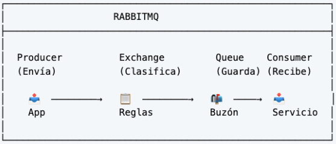
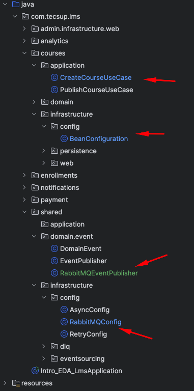

# MIGRACIÓN A RABBITMQ

- Workflow
  

- Clases a modificar



1. Crear el docker compose para RabbitMQ : docker-compose.yml

docker-compose.yml

```yaml
services:
  rabbitmq:
    image: rabbitmq:3-management
    container_name: lms-rabbitmq
    ports:
      - "5672:5672"       # Puerto para conexiones AMQP
      - "15672:15672"     # Puerto para la interfaz de administración
    environment:
      RABBITMQ_DEFAULT_USER: admin
      RABBITMQ_DEFAULT_PASS: admin123
    volumes:
      - rabbitmq_data:/var/lib/rabbitmq
volumes:
  rabbitmq_data:
```
- Ejecutar el docker compose en la carpeta donde se encuentra el archivo docker-compose.yml

```bash

docker-compose up -d

```
- Acceder al enlace http://localhost:15672
  - Usuario: admin
  - Clave: admin123
  
2.- Agregar dependencias de RabbitMQ en el archivo pom.xml

```xml
        <!-- Spring AMQP / RabbitMQ -->
        <dependency>
            <groupId>org.springframework.boot</groupId>
            <artifactId>spring-boot-starter-amqp</artifactId>
        </dependency>

        <dependency>
            <groupId>org.springframework.amqp</groupId>
            <artifactId>spring-rabbit-test</artifactId>
            <scope>test</scope>
        </dependency>

```

3.- Configurar la conexión a RabbitMQ en application.properties

```properties

# Configuration for RabbitMQ
spring.rabbitmq.host=localhost
spring.rabbitmq.port=5672
spring.rabbitmq.username=admin
spring.rabbitmq.password=admin123

```

4.- Crear la configuración de RabbitMQ : RabbitMQConfig.java

- Exchange            -->  "lms.event"
- Course Queue        -->  "lms.course"
- Event Create Course -->  "course.created"

```java    
import org.springframework.amqp.core.Binding;
import org.springframework.amqp.core.BindingBuilder;
import org.springframework.amqp.core.Queue;
import org.springframework.amqp.core.TopicExchange;
import org.springframework.amqp.support.converter.Jackson2JsonMessageConverter;
import org.springframework.amqp.support.converter.MessageConverter;
import org.springframework.context.annotation.Bean;
import org.springframework.context.annotation.Configuration;

/**
 * - Exchange            -->  "lms.event"
 * - Course Queue        -->  "lms.course"
 * - Routing Key for Create Course -->  "course.created"
 */
@Configuration
public class RabbitMQConfig {

    // Exchange Name
    public static final String EXCHANGE_NAME = "lms.event";

    // Queues
    public static final String COURSE_QUEUE = "lms.queue.course";

    // Routing Keys
    public static final String COURSE_CREATED_RK = "course.created";


    // -- Exchanges

    /**
     * Event Exchange
     * @return
     */
    @Bean
    public TopicExchange eventExchange() {
        return new TopicExchange(EXCHANGE_NAME);
    }

    // -- Queues

    /**
     * Course Queue
     * @return
     */
    @Bean
    public Queue courseQueue() {
        return new Queue(COURSE_QUEUE, true);
    }

    // -- Bindings

    /**
     * Course Queue Binding to Event Exchange with Course Created Routing Key
     */
    @Bean
    public Binding courseBinding() {
        // Binding code would go here
        return BindingBuilder
                .bind(courseQueue())
                .to(eventExchange())
                .with(COURSE_CREATED_RK);
    }

    /**
     * Bean for serializacion
     */
    @Bean
    public MessageConverter jsonMessageConverter() {
        return new Jackson2JsonMessageConverter();
    }

}

```

5. Crear el publicador de RabbitMQ : RabbitMQEventPublisher.java

```java
import lombok.RequiredArgsConstructor;
import lombok.extern.slf4j.Slf4j;
import org.springframework.amqp.rabbit.core.RabbitTemplate;
import org.springframework.stereotype.Component;

import static com.tecsup.lms.shared.infrastructure.config.RabbitMQConfig.EXCHANGE_NAME;

@Slf4j
@Component
@RequiredArgsConstructor
public class RabbitMQEventPublisher {

    private final RabbitTemplate template;

    public void publish(String routingKey, DomainEvent event) {

        log.info("Publicando en RabbitMQ: {} [{}]", event.getEventType(), event.getEventId());

        template.convertAndSend(EXCHANGE_NAME
                , routingKey
                , event);

    }
}
```

6. Modificar las siguiente clases

CreateCourseUseCase.java

```
import com.tecsup.lms.courses.domain.event.CourseCreatedEvent;
import com.tecsup.lms.courses.domain.model.Course;
import com.tecsup.lms.courses.domain.repository.CourseRepository;
import com.tecsup.lms.shared.domain.event.RabbitMQEventPublisher;
import lombok.RequiredArgsConstructor;
import lombok.extern.slf4j.Slf4j;

import java.time.LocalDateTime;

import static com.tecsup.lms.shared.infrastructure.config.RabbitMQConfig.COURSE_CREATED_RK;

@Slf4j
@RequiredArgsConstructor
public class CreateCourseUseCase {

    private final CourseRepository repository;

    // private final EventPublisher eventPublisher;
    private final RabbitMQEventPublisher eventPublisher;  // Nueva linea

    public Course createCourse(String title, String description, String instructor) {

        Course course = Course.builder()
                .title(title)
                .description(description)
                .instructor(instructor)
                .status(Course.CourseStatus.DRAFT)
                .createdAt(LocalDateTime.now())
                .build();

        Course saved = repository.save(course);
        log.info("Course created: {}", saved.getId());

        // Publicar el evento
        eventPublisher.publish(
                COURSE_CREATED_RK,   //  Nuevo parametro
                new CourseCreatedEvent(
                        saved.getId().toString(),
                        saved.getTitle(),
                        saved.getInstructor()
                )
        );

        return saved;
    }

}

```


BeanConfiguration.java 

```

import com.tecsup.lms.courses.application.CreateCourseUseCase;
import com.tecsup.lms.courses.application.PublishCourseUseCase;
import com.tecsup.lms.courses.domain.repository.CourseRepository;
import com.tecsup.lms.shared.domain.event.EventPublisher;
import com.tecsup.lms.shared.domain.event.RabbitMQEventPublisher;
import org.springframework.context.annotation.Bean;
import org.springframework.context.annotation.Configuration;

/**
 * CONFIGURACIÓN DE BEANS
 * 
 * Registra los Use Cases y Domain Services como beans de Spring.
 * 
 * Nota: Lombok @RequiredArgsConstructor se encarga de la inyección,
 * aquí solo creamos las instancias.
 */
@Configuration
public class BeanConfiguration {

    @Bean
    public CreateCourseUseCase createCourseUseCase(CourseRepository repository, RabbitMQEventPublisher eventPublisher) {
        return new CreateCourseUseCase(repository, eventPublisher);
    }

    @Bean
    public PublishCourseUseCase publishCourseUseCase(CourseRepository repository, EventPublisher eventPublisher) {
        return new PublishCourseUseCase(repository, eventPublisher);
    }
}
```

7.- Realizar la creación de un curso y revisar en la consola del RabbitMQ que se ha recibido el mensaje